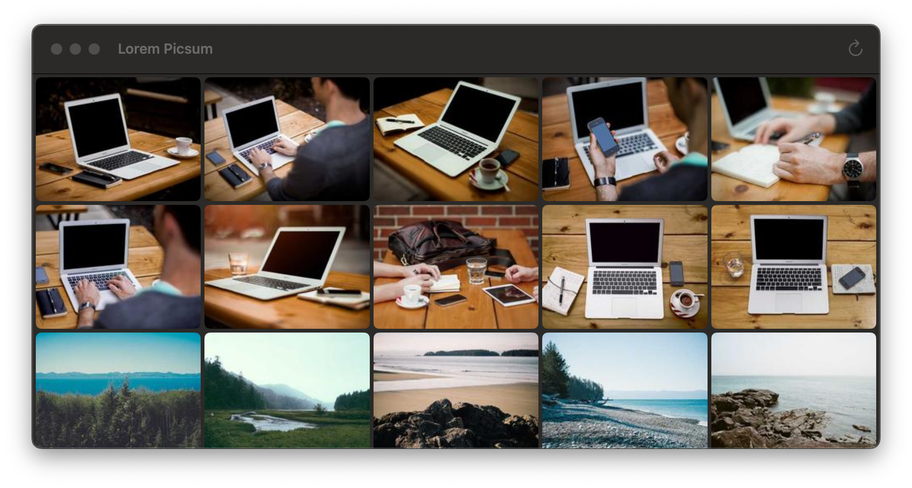
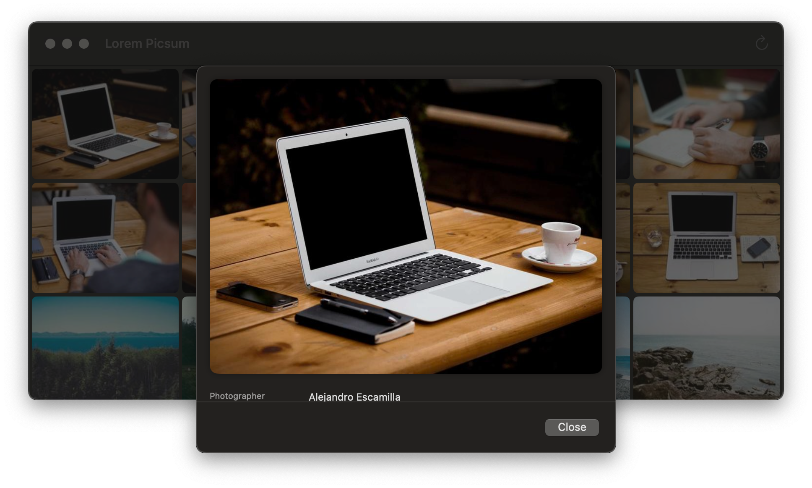
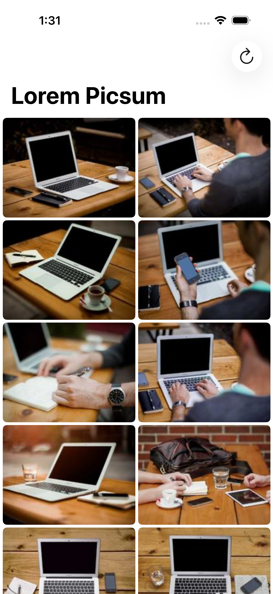
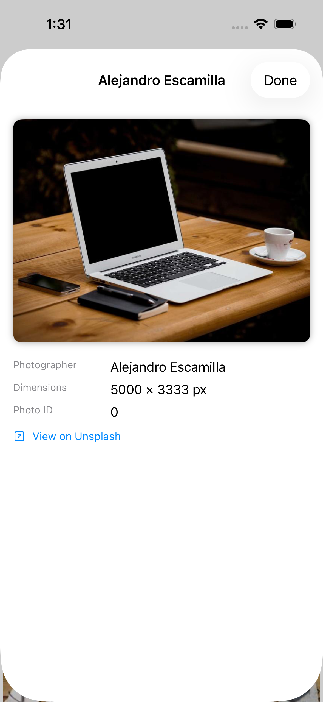

# AWPicsumServices

A Swift Package for integrating the [Lorem Picsum](https://picsum.photos) photo API in iOS and macOS applications. Has no external dependencies.
Uses a **protocol mixin pattern** — conform any Swift type to `AWPicsumPhotosProtocol`
and get full API access through protocol extension default implementations. No subclassing
or dependency injection required.

## Features

- Browse paginated photo feeds
- Fetch individual photo info by ID
- Download resized images at arbitrary dimensions — no API key required
- Zero external dependencies (`Foundation` only)
- `async/await` throughout
- iOS 17+ and macOS 14+
- Includes `AWPicsumService`, a ready-made concrete type

## Quick Start

### As a dependency

Add the package URL to your Xcode project or `Package.swift`:

```swift
.package(url: "https://github.com/asafw/AWPicsumServices", from: "1.0.0")
```

### Use the concrete type

```swift
import AWPicsumServices

let service = AWPicsumService()

// Fetch the first page of photos (30 per page by default)
let photos = try await service.getPhotos(photosRequest: AWPicsumPhotosRequest(page: 1))

// Fetch a single photo's metadata
let photo = try await service.getPhoto(photoRequest: AWPicsumPhotoRequest(id: "237"))

// Download image bytes at a custom size
let url = URL(string: photo.imageURLString(width: 800, height: 600))!
let data = try await service.downloadImageData(from: url)
```

### Conform your own type (mixin pattern)

```swift
@Observable
class MyViewModel: AWPicsumPhotosProtocol {
    // All three methods are available via protocol extension defaults
}
```

Override `urlSession` to inject a custom session for testing:

```swift
@Observable
class MyViewModel: AWPicsumPhotosProtocol {
    var urlSession: URLSession { myCustomSession }
}
```

## API

### `AWPicsumPhotosProtocol`

| Method | Description |
|---|---|
| `getPhotos(photosRequest:)` | Paginated photo list |
| `getPhoto(photoRequest:)` | Single photo metadata by ID |
| `downloadImageData(from:)` | Raw image bytes, with `.returnCacheDataElseLoad` caching |

### `AWPicsumPhoto`

| Property | Type | Description |
|---|---|---|
| `id` | `String` | Unique Picsum photo ID |
| `author` | `String` | Photographer's name |
| `width` | `Int` | Native width in pixels |
| `height` | `Int` | Native height in pixels |
| `url` | `String` | Unsplash detail page URL |
| `downloadURL` | `String` | Direct full-resolution download URL |
| `imageURLString(width:height:)` | `String` | Resized image URL at any dimensions |

### `AWPicsumAPIError`

| Case | When |
|---|---|
| `.networkError` | Non-2xx HTTP status or no response |
| `.parsingError` | Failed URL construction or JSON decoding |

## Demo App

A SwiftUI demo app is included for macOS and iOS in `Examples/PicsumDemoApp`.

**macOS:** run via Swift Package Manager:
```bash
swift run PicsumDemoApp
```

**iOS:** generate an Xcode project with XcodeGen:
```bash
cd Examples/PicsumDemoApp-iOS
xcodegen generate
open PicsumDemoApp-iOS.xcodeproj
```

## Screenshots

### macOS
| Photo Grid | Photo Detail |
|---|---|
|  |  |

### iOS
| Photo Grid | Photo Detail |
|---|---|
|  |  |

## Build & Test

```bash
swift build
swift test                  # unit tests (no network)
swift test --filter AWPicsumServicesIntegrationTests  # live network tests
```

## License

MIT
